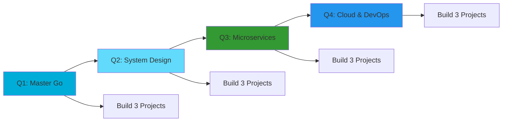

<div align="center">


<!-- Header GIF -->


<!-- Animated Typing Effect -->
<a href="https://git.io/typing-svg"></a>

<!-- Badges -->
<p>
  <a href="https://github.com/Yogiexc?tab=followers">
    
  </a>
  <a href="https://github.com/Yogiexc?tab=repositories&sort=stargazers">
    
  </a>
  
</p>

<!-- Social Links with Icons -->
<p>
  <a href="https://www.linkedin.com/in/bryan-yogie-264306270">
    
  </a>
  <a href="mailto:yogiexsaputra@gmail.com">
    
  </a>
  <a href="https://github.com/Yogiexc/PortofolioProject">
    
  </a>
</p>

</div>

---

## 🚀 About Me

```yaml
name: Bryan Yogie Saputra
location: Surakarta, Central Java, Indonesia 🇮🇩
education: Informatics Engineering @ Universitas Sebelas Maret (UNS)
role: Full-time Student | Part-time Builder | Future Backend Engineer
currently_learning: [Go, System Design, Microservices, Cloud Architecture]
interests: [Backend Development, System Architecture, DevOps, Open Source]
philosophy: "Code with purpose, learn with consistency, build with passion"
fun_fact: "I debug with console.log and I'm proud of it 😄"
```

<details>
<summary>📌 <b>More About Me</b></summary>
<br/>

- 🎯 **Mission**: Building robust, scalable backend systems and understanding technology from the ground up
- 🌱 **Learning Journey**: Started with PHP & JavaScript, now mastering Go and distributed systems
- 🧠 **Philosophy**: I don't just use tools — I understand how they work, why they exist, and when to use them
- 📈 **Approach**: Treating GitHub as my public learning journal and portfolio combined
- 💡 **Belief**: The best way to truly learn is by building, breaking, debugging, and rebuilding
- 🔥 **2025 Goal**: Ship 12+ production-ready projects and contribute to open source

</details>

---

## 🛠️ Tech Stack & Tools

<div align="center">

### 💻 Programming Languages


### 🎨 Frontend Development


### ⚙️ Backend & Databases


### 🔧 DevOps & Tools


</div>

---

## 📊 GitHub Statistics

<div align="center">
  
  
</div>

<div align="center">
  
</div>

---

## 📈 Contribution Activity

<div align="center">
  
</div>

---

## 🚀 Featured Projects

<div align="center">

### 🔥 [FastAPI Monitoring Service](https://github.com/Yogiexc/fastapi-api-monitor)
**Powerful API monitoring & health check service**


```
✨ Async HTTP monitoring with response tracking
⚡ Real-time health status detection  
📊 Advanced pagination & filtering
🔄 Batch monitoring capabilities
📤 Export functionality for reports
```

---

### 💼 [Portfolio Project](https://github.com/Yogiexc/PortofolioProject)
**Personal portfolio showcasing projects & skills**


---

<details>
<summary>🔍 <b>View More Projects</b></summary>
<br/>

Coming soon! Currently building:
- 🏗️ **Go REST API** - Clean architecture microservice
- 🐳 **DevOps Pipeline** - CI/CD with Docker & GitHub Actions
- 📱 **React Dashboard** - Admin panel with real-time data

</details>

</div>

---

## 🐍 Contribution Snake

<div align="center">
  <picture>
    <source media="(prefers-color-scheme: dark)" srcset="https://raw.githubusercontent.com/Yogiexc/Yogiexc/snake/github-snake-dark.svg" />
    <source media="(prefers-color-scheme: light)" srcset="https://raw.githubusercontent.com/Yogiexc/Yogiexc/snake/github-snake.svg" />
    
  </picture>
</div>

---

## 💼 Current Focus

```javascript
const bryan = {
  pronouns: "He/Him",
  location: "Surakarta, Indonesia 🇮🇩",
  
  code: {
    primary: ["Go", "JavaScript", "SQL"],
    learning: ["TypeScript", "Rust"],
    exploring: ["System Design", "Microservices"]
  },
  
  technologies: {
    backend: ["Go", "Node.js", "FastAPI", "Express"],
    frontend: ["React", "Next.js", "TailwindCSS"],
    databases: ["PostgreSQL", "MongoDB", "Redis"],
    devops: ["Docker", "Linux", "Nginx", "Git"]
  },
  
  architecture: {
    patterns: ["Clean Architecture", "Hexagonal", "MVC"],
    principles: ["SOLID", "DRY", "KISS"],
    focus: ["RESTful APIs", "Microservices", "Event-Driven"]
  },
  
  currentChallenge: {
    goal2025: "Build 12+ production-ready projects",
    mission: "Master backend development & system design",
    contribution: "Contribute to open source"
  },
  
  workingOn: [
    "Building scalable Go microservices",
    "Learning distributed systems",
    "Contributing to open source projects"
  ],
  
  funFact: "I believe console.log is the best debugger 🐛"
};

console.log("Let's build something amazing! 🚀");
```

---

## 🎯 2025 Roadmap



---

## 💭 Random Dev Quote

<div align="center">


</div>

---

## 🤝 Let's Connect!

<div align="center">

I'm always open to interesting conversations and collaboration opportunities!

[](https://www.linkedin.com/in/bryan-yogie-264306270)
[](mailto:yogiexsaputra@gmail.com)
[](https://github.com/Yogiexc/PortofolioProject)
[](https://github.com/Yogiexc)

### 📧 Reach out for:
- 💼 Collaboration opportunities
- 🤝 Open source contributions
- 💡 Tech discussions
- 🚀 Project ideas

</div>

---

<div align="center">

<!-- Footer GIF -->


### 💙 Thanks for stopping by!

<sub>⭐ If you like my work, consider giving a star to my repositories!</sub>


</div>

---

<div align="center">
  <sub>✨ Crafted with 💻 and ☕ by <a href="https://github.com/Yogiexc">@Yogiexc</a> • Last updated: January 2025</sub>
</div>
