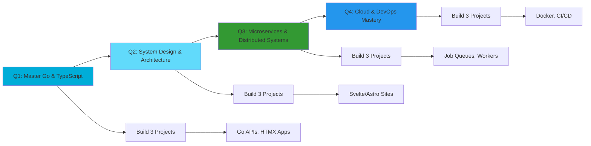

<div align="center">


<!-- Header GIF -->


<!-- Animated Typing Effect -->
<a href="https://git.io/typing-svg"></a>

<!-- Badges -->
<p>
  <a href="https://github.com/Yogiexc?tab=followers">
    
  </a>
  <a href="https://github.com/Yogiexc?tab=repositories&sort=stargazers">
    
  </a>
  
</p>

<!-- Social Links with Icons -->
<p>
  <a href="https://www.linkedin.com/in/bryan-yogie-saputra-264306270">
    
  </a>
  <a href="mailto:yogiexsaputra@gmail.com">
    
  </a>
  <a href="https://github.com/Yogiexc/PortofolioProject">
    
  </a>
  <a href="https://twitter.com/bryanyogiexc">
    
  </a>
  <a href="https://www.instagram.com/yogiexct">
    
  </a>
</p>

</div>

---

## 🚀 About Me

```yaml
name: Bryan Yogie Saputra
pronouns: he/him
location: Surakarta, Indonesia 🇮🇩 (Lat: -7.5690, Long: 110.8283)
education: D3 Teknik Informatika @ Universitas Sebelas Maret (UNS)
nim: V3424090
role: Full-time Student | Part-time Builder | Just Learning to Code
currently_learning: [Go, TypeScript, System Design, Microservices, Cloud Architecture]
interests: [Learning we, System Architecture, DevOps, Open Source, Web Performance]
philosophy: "In progress, not in a rush. Code with purpose, learn with consistency."
fun_fact: "I debug with console.log and I'm proud of it 😄"
repositories: 28
followers: 12
following: 10
```

<details>
<summary>📌 <b>More About Me</b></summary>
<br/>

- 🎯 **Mission**: Building robust, scalable backend systems and understanding technology from the ground up
- 🌱 **Learning Journey**: Started with PHP & JavaScript, now mastering Go, TypeScript, and distributed systems
- 🧠 **Philosophy**: I don't just use tools — I understand how they work, why they exist, and when to use them
- 📈 **Approach**: Treating GitHub as my public learning journal and portfolio combined
- 💡 **Belief**: The best way to truly learn is by building, breaking, debugging, and rebuilding
- 🔥 **2025 Goal**: Ship 12+ production-ready projects and contribute to open source
- ⚡ **Motto**: "In progress, not in a rush" - consistent growth over quick wins

</details>

---

## 🛠️ Tech Stack & Tools

<div align="center">

### 💻 Programming Languages


### 🎨 Frontend Development


### ⚙️ Backend & Databases


### 🔧 DevOps & Tools


### 🎮 Game Development & Other


</div>

---

## 📈 Contribution Activity

<div align="center">
  
</div>

---

## 🚀 Featured Projects

<div align="center">

### 🎨 [Astro Landing Modern](https://github.com/Yogiexc/astro-landing-modern)
**Modern landing page built with Astro framework**


```
✨ Modern, fast static site generation
⚡ Optimized performance & SEO
🎨 Beautiful UI/UX design
```

---

### 🎯 [UI Animation Playground](https://github.com/Yogiexc/ui-animation-playground)
**Experimental playground for CSS animations and transitions**


```
🎭 Advanced CSS animations
💫 Smooth transitions & effects
🎨 Interactive UI components
```

---

### 🔍 [HTMX Go Live Search](https://github.com/Yogiexc/htmx-go-live-search)
**Real-time search implementation with HTMX and Go**


```
⚡ Real-time search without full page reload
🔄 HTMX for dynamic HTML updates
🎯 Go backend for fast responses
```

---

### 📊 [Svelte Mini Dashboard](https://github.com/Yogiexc/svelte-mini-dashboard)
**Mini dashboard exploring Svelte's compile-time reactivity**


```
⚡ Compile-time reactivity
📊 Interactive data visualization
🎨 Clean, minimal UI
```

---

### 🔧 [PHP Native REST API](https://github.com/Yogiexc/php-native-rest-api)
**Learn REST API fundamentals without framework**


```
🎯 Pure PHP implementation
📚 Educational REST API patterns
🔐 Authentication & authorization
```

---

### ⚙️ [Go Job Queue](https://github.com/Yogiexc/go-job-queue)
**Simple Job Queue System with Worker Pool Pattern in Go**


```
⚡ Worker pool pattern implementation
🔄 Concurrent job processing
📊 Queue management system
```

---

### 🔥 [FastAPI API Monitor](https://github.com/Yogiexc/fastapi-api-monitor)
**Powerful API monitoring & health check service**


```
✨ Async HTTP monitoring with response tracking
⚡ Real-time health status detection  
📊 Advanced pagination & filtering
🔄 Batch monitoring capabilities
```

---

### 📈 [Node Trading Bot Simulator](https://github.com/Yogiexc/node-trading-bot-simulator)
**Educational trading bot simulator for learning backend logic**


```
📈 Trading algorithm simulation
🎓 Educational backend patterns
💹 Market data processing
```

---

### 🔐 [CI4 Basic Auth](https://github.com/Yogiexc/ci4-basic-auth)
**Authentication system with CodeIgniter 4**


```
🔐 Secure authentication system
👤 User management
🛡️ Password hashing & security
```

---

### 🌐 [Go Simple REST API](https://github.com/Yogiexc/go-simple-rest-api)
**Clean REST API implementation in Go**


```
⚡ Fast, efficient API
🎯 Clean architecture
📊 CRUD operations
```

---

### 🎮 [Roll-a-Ball Unity Learn](https://github.com/Yogiexc/Roll-a-Ball-Unity-Learn)
**Learning Unity game development fundamentals**


```
🎮 Unity fundamentals
🎯 Physics & collision
🎨 3D game mechanics
```

---

### 🖥️ [ClassForm Product Dashboard](https://github.com/Yogiexc/classform-product-dashboard)
**Product Dashboard with PHP OOP, PDO & MySQL**


```
📊 Product CRUD operations
🔐 Password hashing
📝 Dynamic forms
💾 JSON-based feature storage
```

---

### 📚 [SewaBuku Project](https://github.com/Yogiexc/SewaBukuProject)
**Book rental management system**


```
📚 Book rental management
👥 User management
📊 Transaction tracking
```

---

### 🎬 [Moonton](https://github.com/Yogiexc/moonton)
**Streaming platform clone project**


```
🎬 Video streaming interface
🎨 Modern UI/UX
📱 Responsive design
```

---

### 🐦 [ByteBird](https://github.com/Yogiexc/ByteBird)
**Social media platform built with Vue.js**


```
🐦 Social media features
💬 Real-time interactions
🎨 Vue.js frontend
```

---

<details>
<summary>🔍 <b>View More Projects (Private Repositories)</b></summary>
<br/>

### 🔒 Private Projects
- 🌿 **Cocorbebek Hijau Alam** - TypeScript project (Updated Jul 22, 2025)
- 📅 **Jadwal Kita Organize** - TypeScript organization tool (Updated Jun 25, 2025)
- 🐟 **Ikan Nusantara Jelajah** - TypeScript exploration app (Updated Jun 11, 2025)
- 💰 **Crypto Sim Academy** - TypeScript crypto simulator (Updated Jun 9, 2025)

</details>

</div>

---

## 🐍 Contribution Snake

<div align="center">
  <picture>
    <source media="(prefers-color-scheme: dark)" srcset="https://raw.githubusercontent.com/Yogiexc/Yogiexc/snake/github-snake-dark.svg" />
    <source media="(prefers-color-scheme: light)" srcset="https://raw.githubusercontent.com/Yogiexc/Yogiexc/snake/github-snake.svg" />
    
  </picture>
</div>

---

## 💼 Current Focus

```javascript
const bryan = {
  pronouns: "he/him",
  location: "Surakarta, Indonesia 🇮🇩",
  coordinates: { lat: -7.5690, long: 110.8283 },
  
  code: {
    primary: ["Go", "JavaScript", "TypeScript", "PHP", "SQL"],
    learning: ["Rust", "Svelte", "Astro"],
    exploring: ["System Design", "Microservices", "HTMX"]
  },
  
  technologies: {
    backend: ["Go", "Node.js", "FastAPI", "Express", "PHP Native"],
    frontend: ["React", "Next.js", "Svelte", "Astro", "Vue.js", "HTMX"],
    styling: ["TailwindCSS", "CSS3", "Bootstrap"],
    databases: ["PostgreSQL", "MySQL", "MongoDB", "Redis"],
    devops: ["Docker", "Linux", "Nginx", "Git"],
    gamedev: ["Unity"]
  },
  
  architecture: {
    patterns: ["Clean Architecture", "Hexagonal", "MVC", "Worker Pool"],
    principles: ["SOLID", "DRY", "KISS"],
    focus: ["RESTful APIs", "Microservices", "Event-Driven", "Job Queues"]
  },
  
  education: {
    university: "Universitas Sebelas Maret (UNS)",
    program: "D3 Teknik Informatika",
    nim: "V3424090"
  },
  
  currentChallenge: {
    goal2025: "Build 12+ production-ready projects",
    mission: "Master backend development & system design",
    contribution: "Contribute to open source",
    motto: "In progress, not in a rush"
  },
  
  workingOn: [
    "Building scalable Go microservices",
    "Exploring modern frontend frameworks (Svelte, Astro)",
    "Learning distributed systems & job queues",
    "Contributing to open source projects"
  ],
  
  repositories: {
    total: 28,
    public: 24,
    private: 4
  },
  
  funFact: "I believe console.log is the best debugger 🐛"
};

console.log("Let's build something amazing! 🚀");
```

---

## 🎯 2025 Roadmap



---

## 📚 Learning Path 2025

- ✅ **Q1 2025**: Go fundamentals, HTMX, Svelte, Astro
- 🔄 **Q2 2025**: TypeScript mastery, System design patterns
- 📋 **Q3 2025**: Microservices architecture, Message queues
- 📋 **Q4 2025**: Cloud platforms (AWS/GCP), Kubernetes, CI/CD

---

## 💭 Random Dev Quote

<div align="center">


</div>

---

## 🤝 Let's Connect!

<div align="center">

I'm always open to interesting conversations and collaboration opportunities!

[](https://www.linkedin.com/in/bryan-yogie-saputra-264306270)
[](mailto:yogiexsaputra@gmail.com)
[](https://github.com/Yogiexc/PortofolioProject)
[](https://github.com/Yogiexc)
[](https://twitter.com/bryanyogiexc)
[](https://www.instagram.com/yogiexct)

### 📧 Reach out for:
- 💼 Collaboration opportunities
- 🤝 Open source contributions
- 💡 Tech discussions & knowledge sharing
- 🚀 Project ideas & partnerships
- 🎓 Learning together

</div>

---

<div align="center">

<!-- Footer GIF -->


### 💙 Thanks for stopping by!

<sub>⭐ If you like my work, consider giving a star to my repositories!</sub>

<sub>📊 **28 Public Repositories** • 👥 **12 Followers** • 💻 **Actively Learning & Building**</sub>


</div>

---

<div align="center">
  <sub>✨ Crafted with 💻 and ☕ by <a href="https://github.com/Yogiexc">@Yogiexc</a> • Last updated: January 12, 2025</sub>
  <br/>
  <sub>🌟 "In progress, not in a rush" - Building one commit at a time</sub>
</div>
